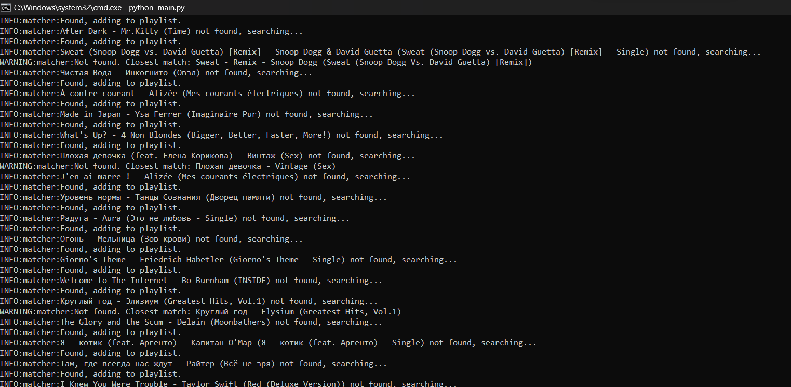

# Mixxer
An app to synchronize your music library between services.


# Features
 - Configurable match threshold
 - Synchronization to playlist
 - Synchronization directly to library
 - Listing of what wasn't recognized

# Installation
Clone the repository, and run `pip install -r requirements.txt`

# Usage
Open `main.py`. Fill values for your musical services. Copy services to `matcher.match()` call. Then run `python main.py`.  
`to_playlist` determines, if synchronization will be performed to a separate playlist or directly into the library.

# Examples
Synchronizing from Apple Music to Yandex Music:
```Python
import services.apple as apple
import services.yandex as yandex

APPLE_DEV_TOKEN = "dev_token_here"
APPLE_USER_TOKEN = "music_user_token_here"
YANDEX_TOKEN = "yandex_music_token_here"

apple_cli = apple.AppleLibrary(APPLE_DEV_TOKEN, APPLE_USER_TOKEN)
yandex_cli = yandex.YandexLibrary(YANDEX_TOKEN)

matcher = Matcher(apple_cli, yandex_cli)
matcher.match(to_playlist=True)
```
Synchronizing from Spotify to Apple Music directly into library:
```Python
import services.apple as apple
import services.spotify as spotify

APPLE_DEV_TOKEN = "dev_token_here"
APPLE_USER_TOKEN = "music_user_token_here"
SPOTIFY_ID = "app_id_here"
SPOTIFY_SECRET = "app_secret_here"

apple_cli = apple.AppleLibrary(APPLE_DEV_TOKEN, APPLE_USER_TOKEN)
spoty_cli = spotify.SpotifyLibrary(SPOTIFY_ID, SPOTIFY_SECRET)

matcher = Matcher(spoty_cli, apple_cli)
matcher.match(to_playlist=False)
```

# TODO
 - Search for multiple results, not for the best one
 - Better UI
 - Better usage instructions
